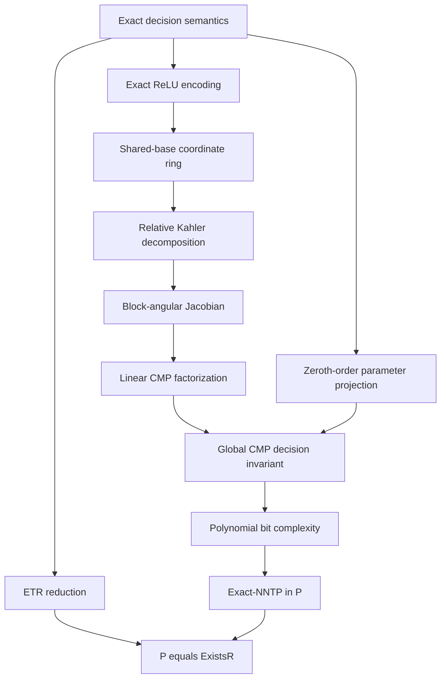

# Proof dependency ledger

Status: draft v0.1, 3 September 2026.

Repository base: `cmp-lean-verification` at commit
`fcca060331defca7226db3e0aecc8bc3c93fcbdf`.  GitHub Actions run 74 reports a
successful Lean build.  The manuscript branch is `p-etr-paper`.

## Claim discipline

The target is the Boolean decision language `Exact-ReLU-NNTP-Decision` for all
finite feed-forward exact-ReLU instances.  Optimization, approximate
feasibility, fixed activation patterns, and smooth-only substitutes are out of
scope for the target theorem.

No collapse theorem may be labelled unconditional until both gates below are
closed:

1. a polynomial-time Turing decider for the exact language; and
2. a polynomial-time, model-matching reduction from ETR to that exact language.

## Dependency graph

## Theorem ledger

| ID | Statement | Status | Dependencies / obstruction |
|---|---|---|---|
| D1 | Exact-NNTP feasibility is an existential Boolean predicate with shared parameters and sample-local witnesses. | Proved | `DecisionProblem.lean`, `ExactProjection.lean`. |
| D2 | `a = ReLU(z)` iff complementarity holds; an existential square-slack polynomialization covers all regimes including `z=a=0`. | Proved | `ReLU.lean`. |
| D3 | The global equality coordinate ring is an iterated tensor product of local quotient rings over the one shared parameter algebra. | Proved in ordinary commutative algebra; Lean currently verifies the ambient polynomial tensor equivalence, not the full quotient theorem. | Full quotient-level Lean formalization remains. |
| D4 | Relative Kähler differentials decompose after the required base changes; the transitivity sequence is exact. | Mathematical proof supplied; Lean verifies transitivity/surjectivity. | `KahlerCore.lean`. |
| D5 | Cross-sample partial derivatives vanish and the Jacobian is block-angular. | Proved | `BlockPolynomial.lean`. |
| D6 | `E(A -> S) = (ker J_A) mapped by J_AS` is intrinsic and gives exact separator factorization for the linearized row space. | Proved | `Separator.lean`, `MessageSubmodule.lean`. |
| D7 | Exact feasibility equals existence of a shared parameter in the intersection of all sample projections. | Proved | `ExactProjection.lean`. |
| D8a | A first-order CMP message subspace alone determines the exact projection for every Exact-ReLU-NNTP instance. | Refuted | `MessageCompletenessAudit.lean` and `ZeroOrderAdversarial.lean`. |
| D8b | A repaired, finitely represented zeroth-order message supports exact separator elimination with polynomial representation growth. | Open | This is the precise missing global-exactness theorem. |
| D9 | The repaired decision procedure has `N poly(P+K,L)` Turing bit complexity. | Open | Requires D8b and representation/bit-growth bounds. |
| D10 | `Exact-ReLU-NNTP-Decision` belongs to P. | Conditional | Requires D8b and D9. |
| D11 | ETR polynomially reduces to the exact formal language defined in the manuscript. | Open/model matching | Related neural-training languages are known ETR-complete, but the reduction must land in this exact language. |
| D12 | `P = NP = ExistsR`. | Conditional | Lean proves only the abstract implication from decision and bridge certificates (`CollapseLogic.lean`). |

## Exact obstruction proved by the audit

For one shared scalar parameter and one ReLU sample with positive target `y`,

`z = theta`, `a = ReLU(z)`, `a = y`,

the exact parameter projection is `{y}`.  At the satisfying point, however,
the scalar cotangent elimination message is all of `R` for every nonzero `y`.
Thus the messages for targets 1 and 2 are identical, although `theta = 1` is
feasible for target 1 and infeasible for target 2.  The symbolic Jacobian also
deletes the target constant because the derivative of `a-y` is independent of
`y`.

Therefore the existing message computes a first-order row-space invariant, not
the semantic existential projection needed by an exact decider.  This failure
already occurs at positive, smooth satisfying points; boundary analysis alone
cannot repair it.

## Required repair theorem

For every rooted subtree `T_v` with separator variables `s`, construct a message
representation `Rep_v` and semantics `[[Rep_v]]` satisfying

`s in [[Rep_v]] iff exists x_internal(T_v), F_T_v(x,s)`.

The proof must establish leaf, merge, contraction, and root cases; the
representation and every operation must remain polynomial in the encoded input
length.  An arbitrary quantifier-free semialgebraic formula has the right
semantics but no polynomial representation or running-time bound is currently
proved.  Any proposed repair must therefore carry zeroth-order constants and
component information without hiding quantifier elimination inside the root
test.
